# School ERP - Visual Data Model

> This file provides visual diagrams of the database schema. For full column definitions, see [data-model.md](./data-model.md).

---

## 1. High-Level Domain Diagram


```mermaid
graph TB
    %% Core
    CORE["`**CORE / TENANT**
    schools, users
    academic_years
    settings, enum_configs`"]

    %% People
    STAFF["`**STAFF & TEACHERS**
    staff, staff_subjects
    class_assignments`"]

    STUDENTS["`**STUDENTS**
    students, parents
    student_enrollments
    student_parents
    student_mentors`"]

    %% Academic
    ACADEMIC["`**ACADEMIC STRUCTURE**
    classes, sections
    class_sections, subjects`"]

    %% Operational
    TIMETABLE["`**TIMETABLE**
    period_configs
    timetable_slots`"]

    ATTENDANCE["`**ATTENDANCE**
    attendance_sessions
    attendance_records`"]

    ASSIGNMENTS["`**ASSIGNMENTS**
    assignments
    assignment_submissions`"]

    EXAMS["`**EXAMINATIONS**
    exams, exam_results
    grade_systems
    grade_scales`"]

    LEAVES["`**LEAVES**
    leave_policies
    leave_applications
    leave_balances`"]

    FEES["`**FEES**
    fee_structures
    fee_records
    fee_payments
    fee_reminders
    fee_penalties`"]

    TRANSPORT["`**TRANSPORT**
    vehicles, drivers
    helpers, routes
    route_assignments
    student_transport`"]

    NOTIFICATIONS["`**NOTIFICATIONS**
    notifications
    notification_recipients`"]

    PAYROLL["`**PAYROLL**
    salary_structures
    payslips
    salary_advances
    salary_revisions`"]

    ACTIVITIES["`**ACTIVITIES**
    activities, awards
    disciplinary_records`"]

    MEETINGS["`**PARENT MEETINGS**
    parent_meetings`"]

    ADHOC["`**ADHOC CLASSES**
    adhoc_classes`"]

    %% Relationships
    CORE -->|school_id on all| STAFF
    CORE -->|school_id on all| STUDENTS
    CORE -->|school_id on all| ACADEMIC
    CORE -->|academic_year_id| TIMETABLE
    CORE -->|academic_year_id| ATTENDANCE
    CORE -->|academic_year_id| ASSIGNMENTS
    CORE -->|academic_year_id| EXAMS
    CORE -->|academic_year_id| LEAVES
    CORE -->|academic_year_id| FEES
    CORE -->|academic_year_id| TRANSPORT
    CORE -->|academic_year_id| PAYROLL
    CORE -->|academic_year_id| ACTIVITIES
    CORE -->|academic_year_id| MEETINGS
    CORE -->|academic_year_id| ADHOC

    ACADEMIC -->|class_section_id| TIMETABLE
    ACADEMIC -->|class_section_id| ATTENDANCE
    ACADEMIC -->|class_section_id| ASSIGNMENTS
    ACADEMIC -->|class_section_id| EXAMS
    ACADEMIC -->|class_section_id| ADHOC

    STAFF -->|staff_id| TIMETABLE
    STAFF -->|staff_id| ATTENDANCE
    STAFF -->|staff_id| ASSIGNMENTS
    STAFF -->|staff_id| EXAMS
    STAFF -->|staff_id| LEAVES
    STAFF -->|staff_id| PAYROLL
    STAFF -->|staff_id| ADHOC

    STUDENTS -->|student_id| ATTENDANCE
    STUDENTS -->|student_id| ASSIGNMENTS
    STUDENTS -->|student_id| EXAMS
    STUDENTS -->|student_id| FEES
    STUDENTS -->|student_id| TRANSPORT
    STUDENTS -->|student_id| ACTIVITIES

    CORE -->|user_id| NOTIFICATIONS
```

---

## 2. Per-Domain ER Diagrams

### 2.1 Core / Tenant

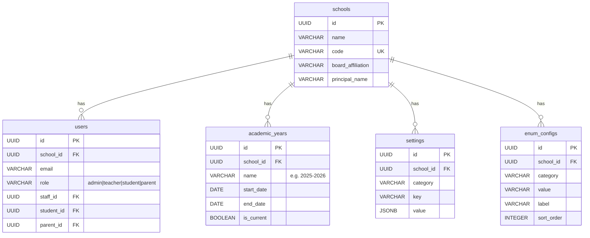
```mermaid
erDiagram
    schools {
        UUID id PK
        VARCHAR name
        VARCHAR code UK
        VARCHAR board_affiliation
        VARCHAR principal_name
    }
    users {
        UUID id PK
        UUID school_id FK
        VARCHAR email
        VARCHAR role "admin|teacher|student|parent"
        UUID staff_id FK
        UUID student_id FK
        UUID parent_id FK
    }
    academic_years {
        UUID id PK
        UUID school_id FK
        VARCHAR name "e.g. 2025-2026"
        DATE start_date
        DATE end_date
        BOOLEAN is_current
    }
    settings {
        UUID id PK
        UUID school_id FK
        VARCHAR category
        VARCHAR key
        JSONB value
    }
    enum_configs {
        UUID id PK
        UUID school_id FK
        VARCHAR category
        VARCHAR value
        VARCHAR label
        INTEGER sort_order
    }

    schools ||--o{ users : "has"
    schools ||--o{ academic_years : "has"
    schools ||--o{ settings : "has"
    schools ||--o{ enum_configs : "has"
```

### 2.2 Staff & Teachers

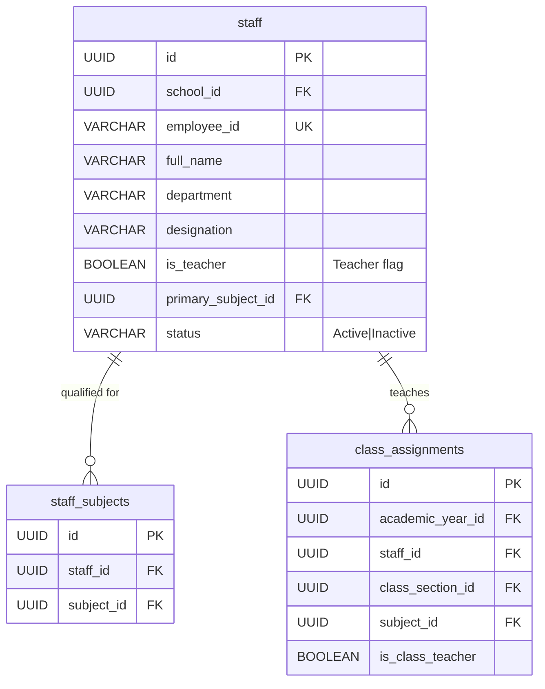
```mermaid
erDiagram
    staff {
        UUID id PK
        UUID school_id FK
        VARCHAR employee_id UK
        VARCHAR full_name
        VARCHAR department
        VARCHAR designation
        BOOLEAN is_teacher "Teacher flag"
        UUID primary_subject_id FK
        VARCHAR status "Active|Inactive"
    }
    staff_subjects {
        UUID id PK
        UUID staff_id FK
        UUID subject_id FK
    }
    class_assignments {
        UUID id PK
        UUID academic_year_id FK
        UUID staff_id FK
        UUID class_section_id FK
        UUID subject_id FK
        BOOLEAN is_class_teacher
    }

    staff ||--o{ staff_subjects : "qualified for"
    staff ||--o{ class_assignments : "teaches"
```

### 2.3 Students

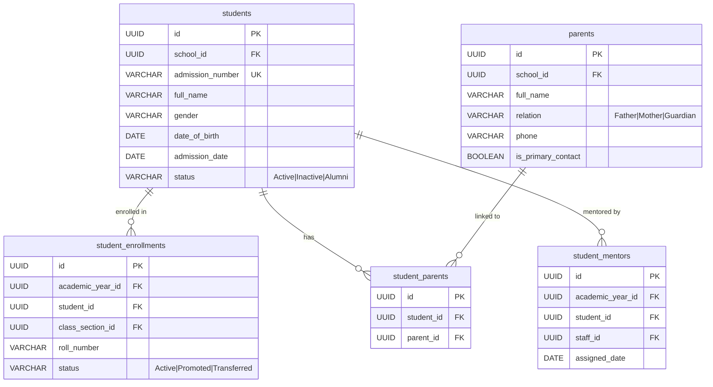
```mermaid
erDiagram
    students {
        UUID id PK
        UUID school_id FK
        VARCHAR admission_number UK
        VARCHAR full_name
        VARCHAR gender
        DATE date_of_birth
        DATE admission_date
        VARCHAR status "Active|Inactive|Alumni"
    }
    student_enrollments {
        UUID id PK
        UUID academic_year_id FK
        UUID student_id FK
        UUID class_section_id FK
        VARCHAR roll_number
        VARCHAR status "Active|Promoted|Transferred"
    }
    parents {
        UUID id PK
        UUID school_id FK
        VARCHAR full_name
        VARCHAR relation "Father|Mother|Guardian"
        VARCHAR phone
        BOOLEAN is_primary_contact
    }
    student_parents {
        UUID id PK
        UUID student_id FK
        UUID parent_id FK
    }
    student_mentors {
        UUID id PK
        UUID academic_year_id FK
        UUID student_id FK
        UUID staff_id FK
        DATE assigned_date
    }

    students ||--o{ student_enrollments : "enrolled in"
    students ||--o{ student_parents : "has"
    parents ||--o{ student_parents : "linked to"
    students ||--o{ student_mentors : "mentored by"
```

### 2.4 Academic Structure

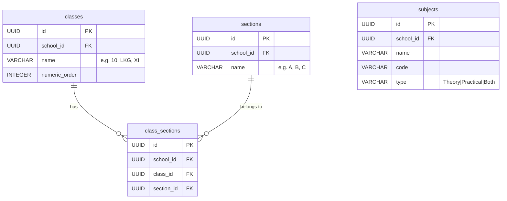
```mermaid
erDiagram
    classes {
        UUID id PK
        UUID school_id FK
        VARCHAR name "e.g. 10, LKG, XII"
        INTEGER numeric_order
    }
    sections {
        UUID id PK
        UUID school_id FK
        VARCHAR name "e.g. A, B, C"
    }
    class_sections {
        UUID id PK
        UUID school_id FK
        UUID class_id FK
        UUID section_id FK
    }
    subjects {
        UUID id PK
        UUID school_id FK
        VARCHAR name
        VARCHAR code
        VARCHAR type "Theory|Practical|Both"
    }

    classes ||--o{ class_sections : "has"
    sections ||--o{ class_sections : "belongs to"
```

### 2.5 Timetable

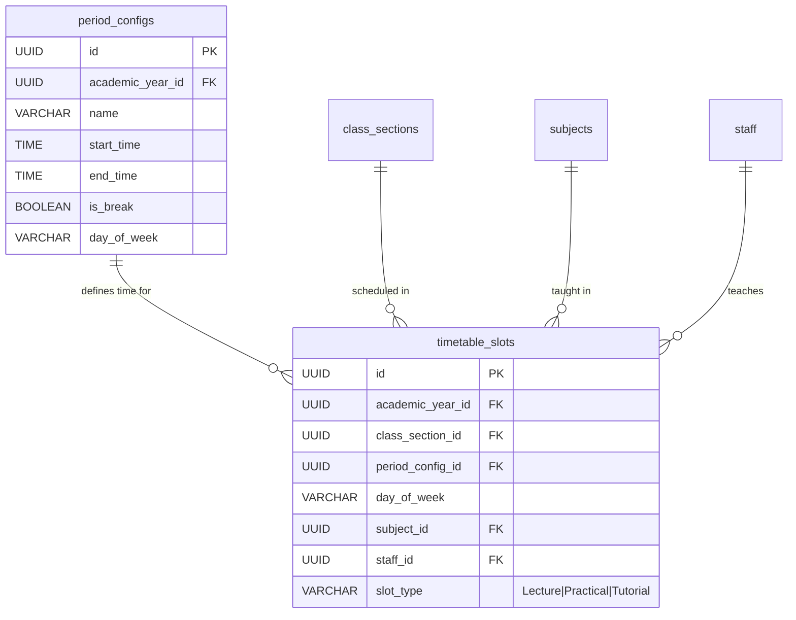
```mermaid
erDiagram
    period_configs {
        UUID id PK
        UUID academic_year_id FK
        VARCHAR name
        TIME start_time
        TIME end_time
        BOOLEAN is_break
        VARCHAR day_of_week
    }
    timetable_slots {
        UUID id PK
        UUID academic_year_id FK
        UUID class_section_id FK
        UUID period_config_id FK
        VARCHAR day_of_week
        UUID subject_id FK
        UUID staff_id FK
        VARCHAR slot_type "Lecture|Practical|Tutorial"
    }

    period_configs ||--o{ timetable_slots : "defines time for"
    class_sections ||--o{ timetable_slots : "scheduled in"
    subjects ||--o{ timetable_slots : "taught in"
    staff ||--o{ timetable_slots : "teaches"
```

### 2.6 Attendance

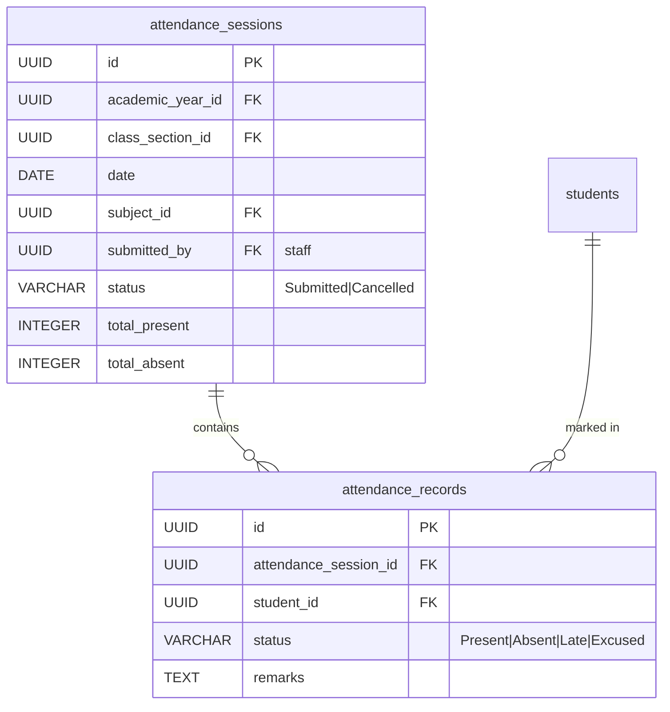
```mermaid
erDiagram
    attendance_sessions {
        UUID id PK
        UUID academic_year_id FK
        UUID class_section_id FK
        DATE date
        UUID subject_id FK
        UUID submitted_by FK "staff"
        VARCHAR status "Submitted|Cancelled"
        INTEGER total_present
        INTEGER total_absent
    }
    attendance_records {
        UUID id PK
        UUID attendance_session_id FK
        UUID student_id FK
        VARCHAR status "Present|Absent|Late|Excused"
        TEXT remarks
    }

    attendance_sessions ||--o{ attendance_records : "contains"
    students ||--o{ attendance_records : "marked in"
```

### 2.7 Assignments

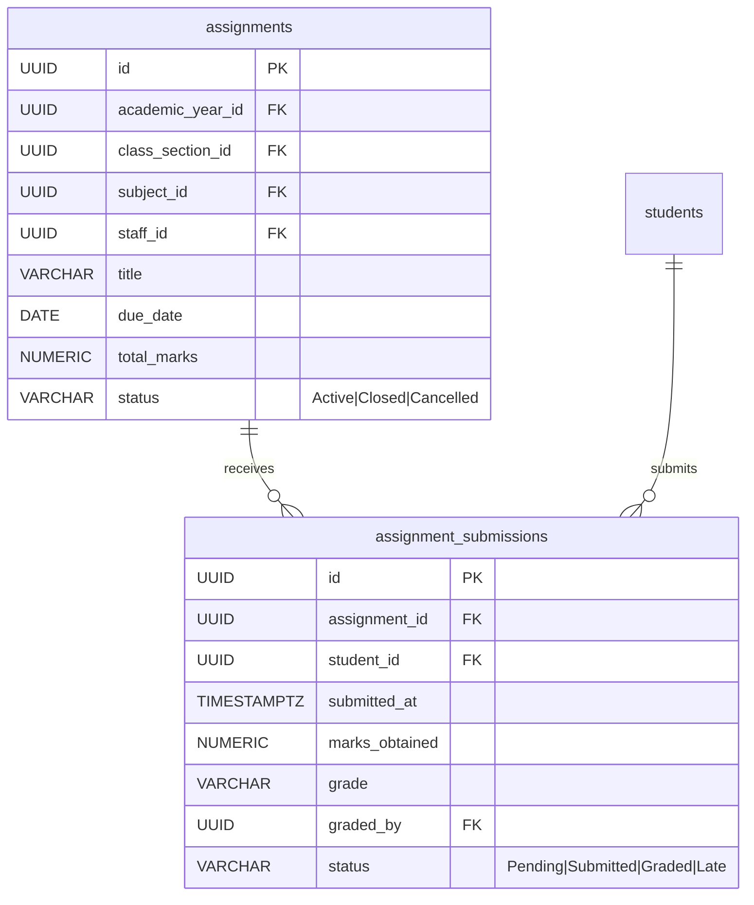
```mermaid
erDiagram
    assignments {
        UUID id PK
        UUID academic_year_id FK
        UUID class_section_id FK
        UUID subject_id FK
        UUID staff_id FK
        VARCHAR title
        DATE due_date
        NUMERIC total_marks
        VARCHAR status "Active|Closed|Cancelled"
    }
    assignment_submissions {
        UUID id PK
        UUID assignment_id FK
        UUID student_id FK
        TIMESTAMPTZ submitted_at
        NUMERIC marks_obtained
        VARCHAR grade
        UUID graded_by FK
        VARCHAR status "Pending|Submitted|Graded|Late"
    }

    assignments ||--o{ assignment_submissions : "receives"
    students ||--o{ assignment_submissions : "submits"
```

### 2.8 Examinations

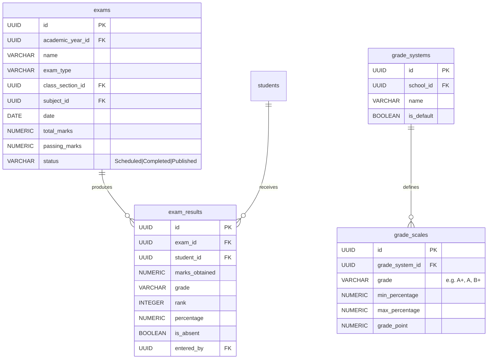
```mermaid
erDiagram
    exams {
        UUID id PK
        UUID academic_year_id FK
        VARCHAR name
        VARCHAR exam_type
        UUID class_section_id FK
        UUID subject_id FK
        DATE date
        NUMERIC total_marks
        NUMERIC passing_marks
        VARCHAR status "Scheduled|Completed|Published"
    }
    exam_results {
        UUID id PK
        UUID exam_id FK
        UUID student_id FK
        NUMERIC marks_obtained
        VARCHAR grade
        INTEGER rank
        NUMERIC percentage
        BOOLEAN is_absent
        UUID entered_by FK
    }
    grade_systems {
        UUID id PK
        UUID school_id FK
        VARCHAR name
        BOOLEAN is_default
    }
    grade_scales {
        UUID id PK
        UUID grade_system_id FK
        VARCHAR grade "e.g. A+, A, B+"
        NUMERIC min_percentage
        NUMERIC max_percentage
        NUMERIC grade_point
    }

    exams ||--o{ exam_results : "produces"
    grade_systems ||--o{ grade_scales : "defines"
    students ||--o{ exam_results : "receives"
```

### 2.9 Leaves

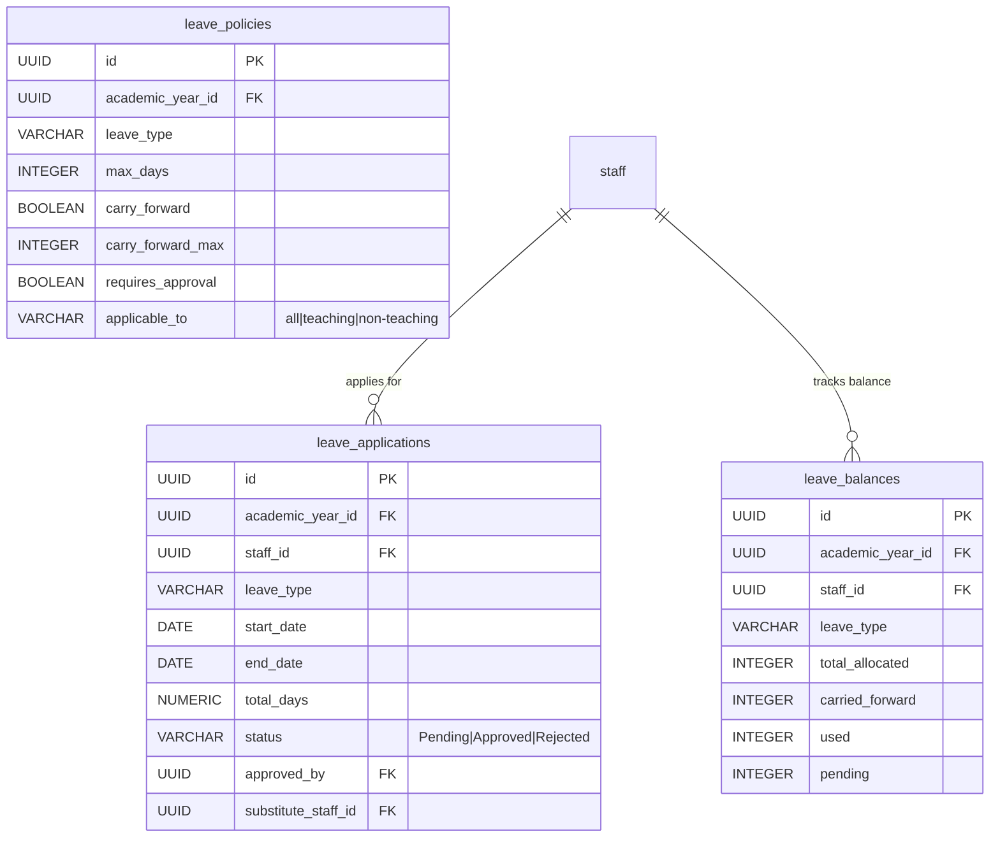
```mermaid
erDiagram
    leave_policies {
        UUID id PK
        UUID academic_year_id FK
        VARCHAR leave_type
        INTEGER max_days
        BOOLEAN carry_forward
        INTEGER carry_forward_max
        BOOLEAN requires_approval
        VARCHAR applicable_to "all|teaching|non-teaching"
    }
    leave_applications {
        UUID id PK
        UUID academic_year_id FK
        UUID staff_id FK
        VARCHAR leave_type
        DATE start_date
        DATE end_date
        NUMERIC total_days
        VARCHAR status "Pending|Approved|Rejected"
        UUID approved_by FK
        UUID substitute_staff_id FK
    }
    leave_balances {
        UUID id PK
        UUID academic_year_id FK
        UUID staff_id FK
        VARCHAR leave_type
        INTEGER total_allocated
        INTEGER carried_forward
        INTEGER used
        INTEGER pending
    }

    staff ||--o{ leave_applications : "applies for"
    staff ||--o{ leave_balances : "tracks balance"
```

### 2.10 Fees

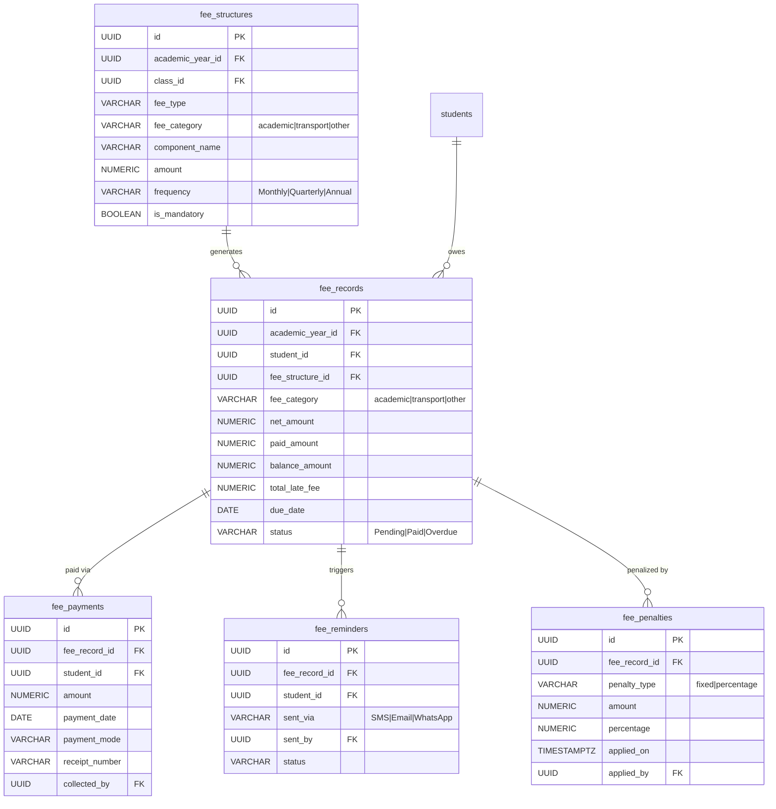
```mermaid
erDiagram
    fee_structures {
        UUID id PK
        UUID academic_year_id FK
        UUID class_id FK
        VARCHAR fee_type
        VARCHAR fee_category "academic|transport|other"
        VARCHAR component_name
        NUMERIC amount
        VARCHAR frequency "Monthly|Quarterly|Annual"
        BOOLEAN is_mandatory
    }
    fee_records {
        UUID id PK
        UUID academic_year_id FK
        UUID student_id FK
        UUID fee_structure_id FK
        VARCHAR fee_category "academic|transport|other"
        NUMERIC net_amount
        NUMERIC paid_amount
        NUMERIC balance_amount
        NUMERIC total_late_fee
        DATE due_date
        VARCHAR status "Pending|Paid|Overdue"
    }
    fee_payments {
        UUID id PK
        UUID fee_record_id FK
        UUID student_id FK
        NUMERIC amount
        DATE payment_date
        VARCHAR payment_mode
        VARCHAR receipt_number
        UUID collected_by FK
    }
    fee_reminders {
        UUID id PK
        UUID fee_record_id FK
        UUID student_id FK
        VARCHAR sent_via "SMS|Email|WhatsApp"
        UUID sent_by FK
        VARCHAR status
    }
    fee_penalties {
        UUID id PK
        UUID fee_record_id FK
        VARCHAR penalty_type "fixed|percentage"
        NUMERIC amount
        NUMERIC percentage
        TIMESTAMPTZ applied_on
        UUID applied_by FK
    }

    fee_structures ||--o{ fee_records : "generates"
    fee_records ||--o{ fee_payments : "paid via"
    fee_records ||--o{ fee_reminders : "triggers"
    fee_records ||--o{ fee_penalties : "penalized by"
    students ||--o{ fee_records : "owes"
```

### 2.11 Transport

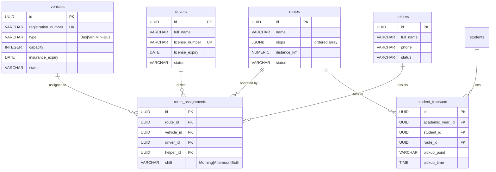
```mermaid
erDiagram
    vehicles {
        UUID id PK
        VARCHAR registration_number UK
        VARCHAR type "Bus|Van|Mini-Bus"
        INTEGER capacity
        DATE insurance_expiry
        VARCHAR status
    }
    drivers {
        UUID id PK
        VARCHAR full_name
        VARCHAR license_number UK
        DATE license_expiry
        VARCHAR status
    }
    helpers {
        UUID id PK
        VARCHAR full_name
        VARCHAR phone
        VARCHAR status
    }
    routes {
        UUID id PK
        VARCHAR name
        JSONB stops "ordered array"
        NUMERIC distance_km
        VARCHAR status
    }
    route_assignments {
        UUID id PK
        UUID route_id FK
        UUID vehicle_id FK
        UUID driver_id FK
        UUID helper_id FK
        VARCHAR shift "Morning|Afternoon|Both"
    }
    student_transport {
        UUID id PK
        UUID academic_year_id FK
        UUID student_id FK
        UUID route_id FK
        VARCHAR pickup_point
        TIME pickup_time
    }

    routes ||--o{ route_assignments : "operated by"
    vehicles ||--o{ route_assignments : "assigned to"
    drivers ||--o{ route_assignments : "drives"
    helpers ||--o{ route_assignments : "assists"
    routes ||--o{ student_transport : "serves"
    students ||--o{ student_transport : "uses"
```

### 2.12 Notifications

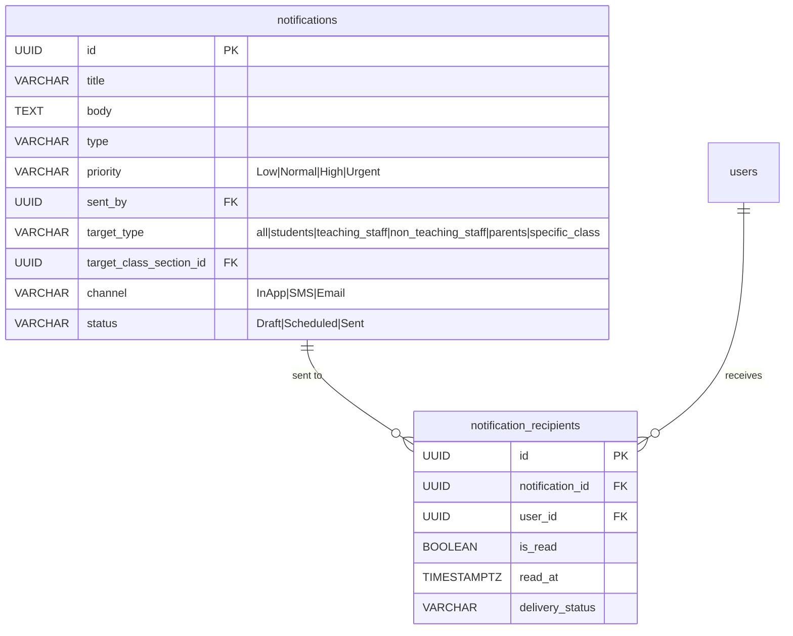
```mermaid
erDiagram
    notifications {
        UUID id PK
        VARCHAR title
        TEXT body
        VARCHAR type
        VARCHAR priority "Low|Normal|High|Urgent"
        UUID sent_by FK
        VARCHAR target_type "all|students|teaching_staff|non_teaching_staff|parents|specific_class"
        UUID target_class_section_id FK
        VARCHAR channel "InApp|SMS|Email"
        VARCHAR status "Draft|Scheduled|Sent"
    }
    notification_recipients {
        UUID id PK
        UUID notification_id FK
        UUID user_id FK
        BOOLEAN is_read
        TIMESTAMPTZ read_at
        VARCHAR delivery_status
    }

    notifications ||--o{ notification_recipients : "sent to"
    users ||--o{ notification_recipients : "receives"
```

### 2.13 Payroll

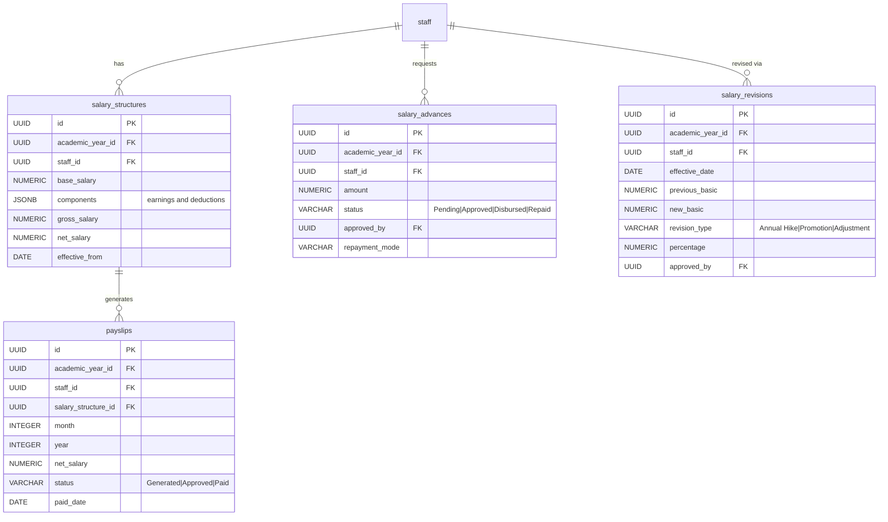
```mermaid
erDiagram
    salary_structures {
        UUID id PK
        UUID academic_year_id FK
        UUID staff_id FK
        NUMERIC base_salary
        JSONB components "earnings and deductions"
        NUMERIC gross_salary
        NUMERIC net_salary
        DATE effective_from
    }
    payslips {
        UUID id PK
        UUID academic_year_id FK
        UUID staff_id FK
        UUID salary_structure_id FK
        INTEGER month
        INTEGER year
        NUMERIC net_salary
        VARCHAR status "Generated|Approved|Paid"
        DATE paid_date
    }
    salary_advances {
        UUID id PK
        UUID academic_year_id FK
        UUID staff_id FK
        NUMERIC amount
        VARCHAR status "Pending|Approved|Disbursed|Repaid"
        UUID approved_by FK
        VARCHAR repayment_mode
    }
    salary_revisions {
        UUID id PK
        UUID academic_year_id FK
        UUID staff_id FK
        DATE effective_date
        NUMERIC previous_basic
        NUMERIC new_basic
        VARCHAR revision_type "Annual Hike|Promotion|Adjustment"
        NUMERIC percentage
        UUID approved_by FK
    }

    salary_structures ||--o{ payslips : "generates"
    staff ||--o{ salary_structures : "has"
    staff ||--o{ salary_advances : "requests"
    staff ||--o{ salary_revisions : "revised via"
```

### 2.14 Activities, Awards & Discipline

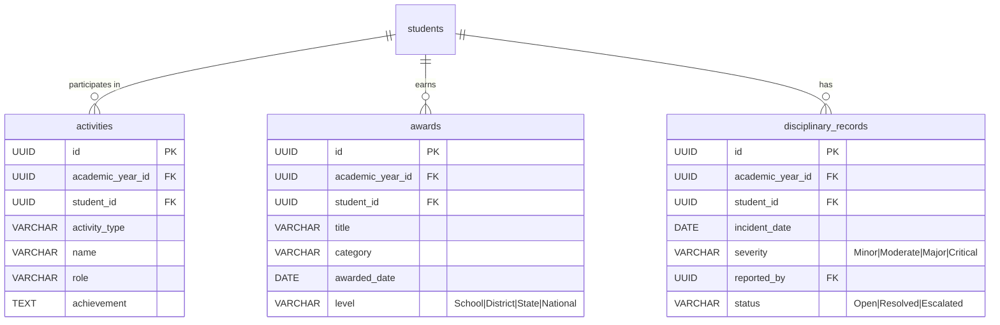
```mermaid
erDiagram
    activities {
        UUID id PK
        UUID academic_year_id FK
        UUID student_id FK
        VARCHAR activity_type
        VARCHAR name
        VARCHAR role
        TEXT achievement
    }
    awards {
        UUID id PK
        UUID academic_year_id FK
        UUID student_id FK
        VARCHAR title
        VARCHAR category
        DATE awarded_date
        VARCHAR level "School|District|State|National"
    }
    disciplinary_records {
        UUID id PK
        UUID academic_year_id FK
        UUID student_id FK
        DATE incident_date
        VARCHAR severity "Minor|Moderate|Major|Critical"
        UUID reported_by FK
        VARCHAR status "Open|Resolved|Escalated"
    }

    students ||--o{ activities : "participates in"
    students ||--o{ awards : "earns"
    students ||--o{ disciplinary_records : "has"
```

### 2.15 Parent Meetings & Adhoc Classes

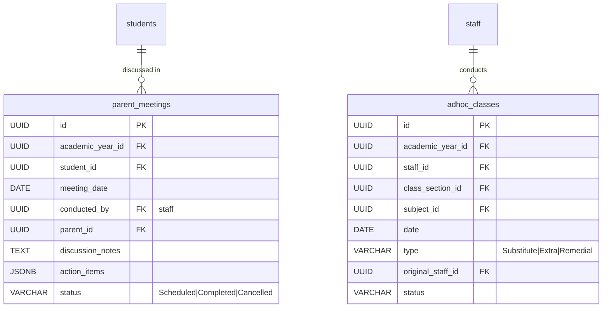
```mermaid
erDiagram
    parent_meetings {
        UUID id PK
        UUID academic_year_id FK
        UUID student_id FK
        DATE meeting_date
        UUID conducted_by FK "staff"
        UUID parent_id FK
        TEXT discussion_notes
        JSONB action_items
        VARCHAR status "Scheduled|Completed|Cancelled"
    }
    adhoc_classes {
        UUID id PK
        UUID academic_year_id FK
        UUID staff_id FK
        UUID class_section_id FK
        UUID subject_id FK
        DATE date
        VARCHAR type "Substitute|Extra|Remedial"
        UUID original_staff_id FK
        VARCHAR status
    }

    students ||--o{ parent_meetings : "discussed in"
    staff ||--o{ adhoc_classes : "conducts"
```

---

## 3. Foreign Key Relationship Map

| From Table.Column | To Table.Column | Notes |
|---|---|---|
| `users.school_id` | `schools.id` | Multi-tenancy |
| `users.staff_id` | `staff.id` | Auth link for admin/teacher |
| `users.student_id` | `students.id` | Auth link for student |
| `users.parent_id` | `parents.id` | Auth link for parent |
| `staff.primary_subject_id` | `subjects.id` | Primary teaching subject |
| `staff_subjects.staff_id` | `staff.id` | CASCADE |
| `staff_subjects.subject_id` | `subjects.id` | |
| `class_assignments.staff_id` | `staff.id` | |
| `class_assignments.class_section_id` | `class_sections.id` | |
| `class_assignments.subject_id` | `subjects.id` | |
| `class_assignments.academic_year_id` | `academic_years.id` | |
| `class_sections.class_id` | `classes.id` | |
| `class_sections.section_id` | `sections.id` | |
| `student_enrollments.student_id` | `students.id` | |
| `student_enrollments.class_section_id` | `class_sections.id` | |
| `student_enrollments.academic_year_id` | `academic_years.id` | |
| `student_parents.student_id` | `students.id` | CASCADE |
| `student_parents.parent_id` | `parents.id` | CASCADE |
| `student_mentors.student_id` | `students.id` | |
| `student_mentors.staff_id` | `staff.id` | |
| `student_mentors.academic_year_id` | `academic_years.id` | |
| `timetable_slots.class_section_id` | `class_sections.id` | |
| `timetable_slots.period_config_id` | `period_configs.id` | |
| `timetable_slots.subject_id` | `subjects.id` | |
| `timetable_slots.staff_id` | `staff.id` | |
| `timetable_slots.academic_year_id` | `academic_years.id` | |
| `attendance_sessions.class_section_id` | `class_sections.id` | |
| `attendance_sessions.submitted_by` | `staff.id` | |
| `attendance_sessions.subject_id` | `subjects.id` | |
| `attendance_sessions.period_config_id` | `period_configs.id` | |
| `attendance_records.attendance_session_id` | `attendance_sessions.id` | CASCADE |
| `attendance_records.student_id` | `students.id` | |
| `assignments.class_section_id` | `class_sections.id` | |
| `assignments.subject_id` | `subjects.id` | |
| `assignments.staff_id` | `staff.id` | |
| `assignment_submissions.assignment_id` | `assignments.id` | CASCADE |
| `assignment_submissions.student_id` | `students.id` | |
| `assignment_submissions.graded_by` | `staff.id` | |
| `exams.class_section_id` | `class_sections.id` | |
| `exams.subject_id` | `subjects.id` | |
| `exams.conducted_by` | `staff.id` | |
| `exam_results.exam_id` | `exams.id` | CASCADE |
| `exam_results.student_id` | `students.id` | |
| `exam_results.entered_by` | `staff.id` | |
| `grade_scales.grade_system_id` | `grade_systems.id` | CASCADE |
| `leave_applications.staff_id` | `staff.id` | |
| `leave_applications.approved_by` | `staff.id` | |
| `leave_applications.substitute_staff_id` | `staff.id` | |
| `leave_balances.staff_id` | `staff.id` | |
| `leave_balances.academic_year_id` | `academic_years.id` | |
| `fee_structures.class_id` | `classes.id` | |
| `fee_records.student_id` | `students.id` | |
| `fee_records.fee_structure_id` | `fee_structures.id` | |
| `fee_payments.fee_record_id` | `fee_records.id` | |
| `fee_payments.student_id` | `students.id` | |
| `fee_payments.collected_by` | `staff.id` | |
| `fee_reminders.student_id` | `students.id` | |
| `fee_reminders.fee_record_id` | `fee_records.id` | |
| `fee_reminders.sent_by` | `staff.id` | |
| `fee_penalties.fee_record_id` | `fee_records.id` | |
| `fee_penalties.applied_by` | `staff.id` | |
| `route_assignments.route_id` | `routes.id` | |
| `route_assignments.vehicle_id` | `vehicles.id` | |
| `route_assignments.driver_id` | `drivers.id` | |
| `route_assignments.helper_id` | `helpers.id` | |
| `student_transport.student_id` | `students.id` | |
| `student_transport.route_id` | `routes.id` | |
| `notifications.sent_by` | `staff.id` | |
| `notifications.target_class_section_id` | `class_sections.id` | |
| `notification_recipients.notification_id` | `notifications.id` | CASCADE |
| `notification_recipients.user_id` | `users.id` | |
| `salary_structures.staff_id` | `staff.id` | |
| `payslips.staff_id` | `staff.id` | |
| `payslips.salary_structure_id` | `salary_structures.id` | |
| `salary_advances.staff_id` | `staff.id` | |
| `salary_advances.approved_by` | `staff.id` | |
| `salary_revisions.staff_id` | `staff.id` | |
| `salary_revisions.approved_by` | `staff.id` | |
| `salary_revisions.academic_year_id` | `academic_years.id` | |
| `activities.student_id` | `students.id` | |
| `activities.recorded_by` | `staff.id` | |
| `awards.student_id` | `students.id` | |
| `awards.recorded_by` | `staff.id` | |
| `disciplinary_records.student_id` | `students.id` | |
| `disciplinary_records.reported_by` | `staff.id` | |
| `parent_meetings.student_id` | `students.id` | |
| `parent_meetings.conducted_by` | `staff.id` | |
| `parent_meetings.parent_id` | `parents.id` | |
| `adhoc_classes.staff_id` | `staff.id` | |
| `adhoc_classes.class_section_id` | `class_sections.id` | |
| `adhoc_classes.subject_id` | `subjects.id` | |
| `adhoc_classes.original_staff_id` | `staff.id` | |

---

## 4. Data Flow Diagrams

### 4.1 Exam Results Flow

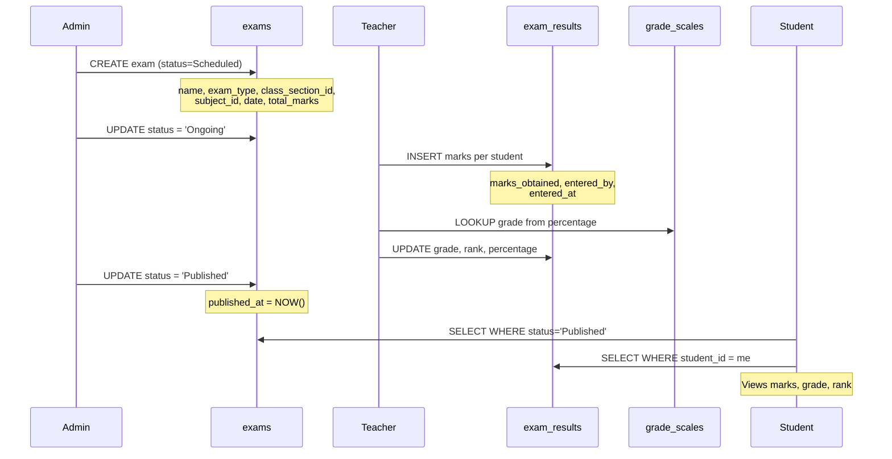
```mermaid
sequenceDiagram
    participant Admin
    participant ExamsTable as exams
    participant Teacher
    participant ResultsTable as exam_results
    participant GradeScale as grade_scales
    participant Student

    Admin->>ExamsTable: CREATE exam (status=Scheduled)
    Note over ExamsTable: name, exam_type, class_section_id,<br/>subject_id, date, total_marks

    Admin->>ExamsTable: UPDATE status = 'Ongoing'
    Teacher->>ResultsTable: INSERT marks per student
    Note over ResultsTable: marks_obtained, entered_by,<br/>entered_at

    Teacher->>GradeScale: LOOKUP grade from percentage
    Teacher->>ResultsTable: UPDATE grade, rank, percentage

    Admin->>ExamsTable: UPDATE status = 'Published'
    Note over ExamsTable: published_at = NOW()

    Student->>ExamsTable: SELECT WHERE status='Published'
    Student->>ResultsTable: SELECT WHERE student_id = me
    Note over Student: Views marks, grade, rank
```

### 4.2 Fee Payment Flow (with Penalties)

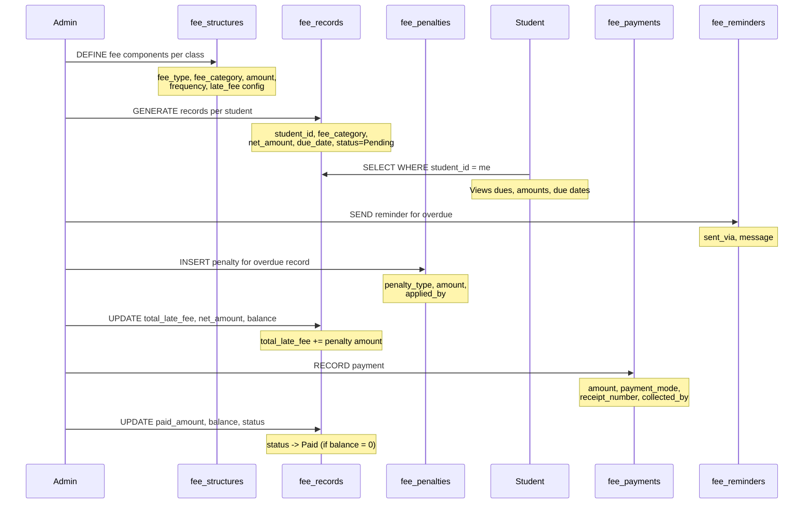
```mermaid
sequenceDiagram
    participant Admin
    participant Structure as fee_structures
    participant FeeRec as fee_records
    participant Penalties as fee_penalties
    participant Student
    participant Payments as fee_payments
    participant Reminders as fee_reminders

    Admin->>Structure: DEFINE fee components per class
    Note over Structure: fee_type, fee_category, amount,<br/>frequency, late_fee config

    Admin->>FeeRec: GENERATE records per student
    Note over FeeRec: student_id, fee_category,<br/>net_amount, due_date, status=Pending

    Student->>FeeRec: SELECT WHERE student_id = me
    Note over Student: Views dues, amounts, due dates

    Admin->>Reminders: SEND reminder for overdue
    Note over Reminders: sent_via, message

    Admin->>Penalties: INSERT penalty for overdue record
    Note over Penalties: penalty_type, amount,<br/>applied_by

    Admin->>FeeRec: UPDATE total_late_fee, net_amount, balance
    Note over FeeRec: total_late_fee += penalty amount

    Admin->>Payments: RECORD payment
    Note over Payments: amount, payment_mode,<br/>receipt_number, collected_by

    Admin->>FeeRec: UPDATE paid_amount, balance, status
    Note over FeeRec: status -> Paid (if balance = 0)
```

### 4.3 Attendance Flow

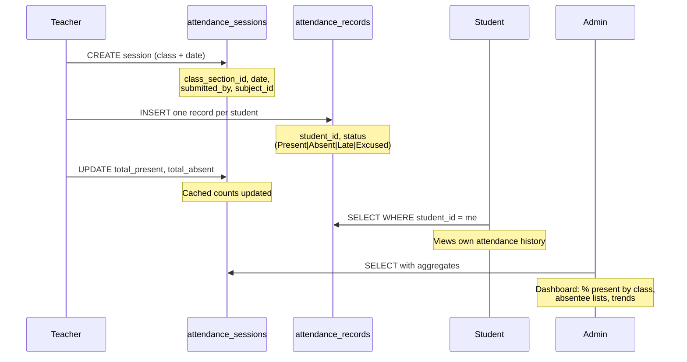
```mermaid
sequenceDiagram
    participant Teacher
    participant Sessions as attendance_sessions
    participant Records as attendance_records
    participant Student
    participant Admin

    Teacher->>Sessions: CREATE session (class + date)
    Note over Sessions: class_section_id, date,<br/>submitted_by, subject_id

    Teacher->>Records: INSERT one record per student
    Note over Records: student_id, status<br/>(Present|Absent|Late|Excused)

    Teacher->>Sessions: UPDATE total_present, total_absent
    Note over Sessions: Cached counts updated

    Student->>Records: SELECT WHERE student_id = me
    Note over Student: Views own attendance history

    Admin->>Sessions: SELECT with aggregates
    Note over Admin: Dashboard: % present by class,<br/>absentee lists, trends
```

### 4.4 Leave Application Flow (with Balances)

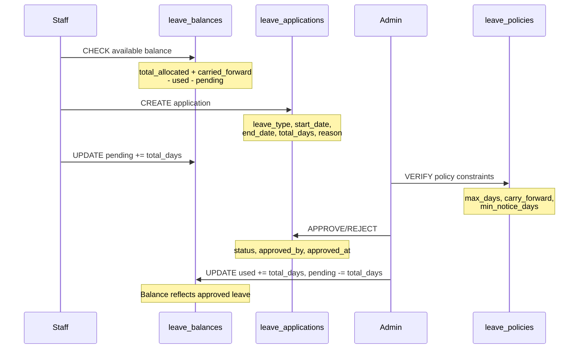
```mermaid
sequenceDiagram
    participant Staff
    participant Balances as leave_balances
    participant Applications as leave_applications
    participant Admin
    participant Policies as leave_policies

    Staff->>Balances: CHECK available balance
    Note over Balances: total_allocated + carried_forward<br/>- used - pending

    Staff->>Applications: CREATE application
    Note over Applications: leave_type, start_date,<br/>end_date, total_days, reason

    Staff->>Balances: UPDATE pending += total_days

    Admin->>Policies: VERIFY policy constraints
    Note over Policies: max_days, carry_forward,<br/>min_notice_days

    Admin->>Applications: APPROVE/REJECT
    Note over Applications: status, approved_by, approved_at

    Admin->>Balances: UPDATE used += total_days, pending -= total_days
    Note over Balances: Balance reflects approved leave
```

---

## 5. Academic Year Boundary Diagram

```mermaid
graph LR
    subgraph PERMANENT["PERMANENT TABLES (not scoped to academic year)"]
        direction TB
        schools["schools"]
        users["users"]
        settings["settings"]
        enum_configs["enum_configs"]
        classes["classes"]
        sections["sections"]
        class_sections["class_sections"]
        subjects["subjects"]
        staff["staff"]
        students["students"]
        parents["parents"]
        student_parents["student_parents"]
        vehicles["vehicles"]
        drivers["drivers"]
        helpers["helpers"]
        routes["routes"]
        grade_systems["grade_systems"]
        grade_scales["grade_scales"]
    end

    subgraph YEARLY["ACADEMIC YEAR SCOPED TABLES (have academic_year_id FK)"]
        direction TB
        academic_years["academic_years"]
        student_enrollments["student_enrollments"]
        class_assignments["class_assignments"]
        student_mentors["student_mentors"]
        period_configs["period_configs"]
        timetable_slots["timetable_slots"]
        attendance_sessions["attendance_sessions"]
        assignments["assignments"]
        exams["exams"]
        leave_policies["leave_policies"]
        leave_applications["leave_applications"]
        leave_balances["leave_balances"]
        fee_structures["fee_structures"]
        fee_records["fee_records"]
        fee_reminders["fee_reminders"]
        student_transport["student_transport"]
        salary_structures["salary_structures"]
        payslips["payslips"]
        salary_advances["salary_advances"]
        salary_revisions["salary_revisions"]
        activities["activities"]
        awards["awards"]
        disciplinary_records["disciplinary_records"]
        parent_meetings["parent_meetings"]
        adhoc_classes["adhoc_classes"]
    end

    subgraph CHILD["CHILD TABLES (scoped via parent FK, not directly by year)"]
        direction TB
        attendance_records["attendance_records (via session)"]
        assignment_submissions["assignment_submissions (via assignment)"]
        exam_results["exam_results (via exam)"]
        fee_payments["fee_payments (via fee_record)"]
        fee_penalties["fee_penalties (via fee_record)"]
        notification_recipients["notification_recipients (via notification)"]
        route_assignments["route_assignments (via route)"]
        staff_subjects["staff_subjects (via staff)"]
        notifications["notifications"]
    end

    PERMANENT --- academic_years
    academic_years -->|scopes| YEARLY
    YEARLY -->|parents| CHILD
```

### Summary Table

| Scope | Count | Tables |
|-------|-------|--------|
| **Permanent** | 18 | schools, users, settings, enum_configs, classes, sections, class_sections, subjects, staff, students, parents, student_parents, vehicles, drivers, helpers, routes, grade_systems, grade_scales |
| **Year-scoped** | 25 | student_enrollments, class_assignments, student_mentors, period_configs, timetable_slots, attendance_sessions, assignments, exams, leave_policies, leave_applications, leave_balances, fee_structures, fee_records, fee_reminders, student_transport, salary_structures, payslips, salary_advances, salary_revisions, activities, awards, disciplinary_records, parent_meetings, adhoc_classes, notifications |
| **Child (via parent)** | 9 | attendance_records, assignment_submissions, exam_results, fee_payments, fee_penalties, notification_recipients, route_assignments, staff_subjects, academic_years |

---

## 6. Staff-Teacher Inheritance Diagram

```mermaid
graph TB
    subgraph STAFF_TABLE["staff table (single table for ALL employees)"]
        direction TB
        common["`**Common Fields (all staff)**
        id, employee_id, full_name
        email, phone, department
        designation, employment_type
        joining_date, status`"]

        teacher_fields["`**Teacher-Specific Fields**
        is_teacher = TRUE
        primary_subject_id -> subjects
        max_workload_hours`"]

        non_teacher["`**Non-Teaching Staff**
        is_teacher = FALSE
        primary_subject_id = NULL
        max_workload_hours = NULL`"]
    end

    subgraph TEACHER_ROLE["When is_teacher = TRUE, staff member can:"]
        direction TB
        t1["Be assigned to class_assignments"]
        t2["Appear in timetable_slots.staff_id"]
        t3["Submit attendance_sessions"]
        t4["Create assignments"]
        t5["Enter exam_results"]
        t6["Be assigned as student_mentors"]
        t7["Conduct adhoc_classes"]
        t8["Be substitute in leave_applications"]
    end

    subgraph ALL_STAFF_ROLE["ALL staff (teacher or not) can:"]
        direction TB
        a1["Have a user account (users.staff_id)"]
        a2["Have salary_structures & payslips"]
        a3["Apply for leave_applications"]
        a4["Request salary_advances"]
        a5["Collect fee_payments"]
        a6["Send notifications"]
        a7["Record activities/awards/discipline"]
        a8["Have salary_revisions tracked"]
    end

    common --> teacher_fields
    common --> non_teacher
    teacher_fields --> TEACHER_ROLE
    common --> ALL_STAFF_ROLE

    subgraph QUERY_PATTERN["Query Pattern"]
        direction LR
        q1["`SELECT * FROM staff
        WHERE school_id = ?
        AND is_teacher = true
        AND is_active = true`"]
        q2["Returns: all active teachers"]
    end
```

### Role Differentiation via `is_teacher` Flag

```
+------------------------------------------------------------------+
|                         staff                                      |
+------------------------------------------------------------------+
| employee_id | full_name     | designation   | is_teacher | dept   |
|-------------|---------------|---------------|------------|--------|
| EMP001      | Rajesh Kumar  | Principal     | false      | Admin  |
| EMP002      | Priya Sharma  | HOD           | true       | Teach  |
| EMP003      | Amit Patel    | Sr. Teacher   | true       | Teach  |
| EMP004      | Neha Singh    | Accountant    | false      | Accts  |
| EMP005      | Ravi Verma    | Librarian     | false      | Library|
| EMP006      | Sita Devi     | Teacher       | true       | Teach  |
| EMP007      | Mohan Das     | Peon          | false      | Admin  |
+------------------------------------------------------------------+
                                |
                    +-----------+-----------+
                    |                       |
          is_teacher = true        is_teacher = false
                    |                       |
        +-----------+----------+    +------+------+
        | Can teach classes    |    | Cannot be   |
        | Can mark attendance  |    | assigned to |
        | Can grade exams      |    | timetable   |
        | Appears in timetable |    | or classes  |
        | Has subject mapping  |    |             |
        +----------------------+    +-------------+
```

---

## Quick Reference: Table Count by Domain

| # | Domain | Tables | Key Entry Points |
|---|--------|--------|-----------------|
| 1 | Core/Tenant | 5 | `schools`, `users`, `academic_years` |
| 2 | Staff & Teachers | 3 | `staff` (is_teacher flag) |
| 3 | Students | 5 | `students`, `student_enrollments` |
| 4 | Academic Structure | 4 | `class_sections`, `subjects` |
| 5 | Timetable | 2 | `timetable_slots` |
| 6 | Attendance | 2 | `attendance_sessions` |
| 7 | Assignments | 2 | `assignments` |
| 8 | Examinations | 4 | `exams`, `grade_systems` |
| 9 | Leaves | 3 | `leave_applications`, `leave_balances` |
| 10 | Fees | 5 | `fee_records`, `fee_payments`, `fee_penalties` |
| 11 | Transport | 6 | `routes`, `route_assignments` |
| 12 | Notifications | 2 | `notifications` |
| 13 | Payroll | 4 | `salary_structures`, `payslips`, `salary_revisions` |
| 14 | Activities/Awards | 3 | `activities`, `awards`, `disciplinary_records` |
| 15 | Parent Meetings | 1 | `parent_meetings` |
| 16 | Adhoc Classes | 1 | `adhoc_classes` |
| | **TOTAL** | **52** | |
